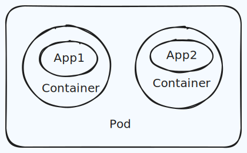

+++
title = 'podman 使用体验'
date = 2025-01-19T10:43:33+08:00
draft = false
tags = ['科技','Linux']

+++

日常经常需要使用容器，时常想要 docker 更轻量一些，比如不需要 daemon，不需要 root，普通用户就可以使用上。  
然后被安利了 podman，使用了挺长时间了，以下是我的安利~

## daemonless

如题，podman 不需要跑一个 daemon 来管理容器。  
具体实现的话，大概是底层的 [oci runtime](https://github.com/opencontainers/runtime-spec) 会在 `XDG_RUNTIME_DIR` 给每个容器一个独立的文件夹来存放一些状态信息，可以被 podman cli 读取和管理。

### socket

podman 仍然提供了通过 socket 来管理的功能，这个 socket 需要单独跑一个 daemon，不过非常轻，类似提供 podman cli 的功能同时带有验证。

`systemctl --user status podman.socket`  

`systemctl --user enable --now podman.socket`

## rootless

与其把“权力”关进笼子里，不如一开始就分离需要“权力”的部分。  
普通用户使用 podman 默认就是 `rootless`。

配置文件: `~/.config/containers`  
容器存储: `~/.local/share/containers`  

### storage driver

- overlay(default)  
  需要安装 `fuse-overlayfs`
- btrfs  
  推荐在 fstab 添加 `user_subvol_rm_allowed` 挂载选项，[来源](https://github.com/containers/storage/pull/508)。
- zfs...  

### [pasta](https://passt.top/passt/about/) User-Mode Networking 

`slirp4netns` 的替代，拥有更好的性能，是现在 podman 5.x 默认的网络实现(rootless)

> *pasta* (same binary as *passt*, different command) offers equivalent functionality, for network namespaces: traffic is forwarded using a tap interface inside the namespace, without the need to create further interfaces on the host, hence not requiring any capabilities or privileges.

> Starting with Linux 3.8, unprivileged users can create [`network_namespaces(7)`](http://man7.org/linux/man-pages/man7/network_namespaces.7.html) along with [`user_namespaces(7)`](http://man7.org/linux/man-pages/man7/user_namespaces.7.html). However, unprivileged network namespaces had not been very useful, because creating [`veth(4)`](http://man7.org/linux/man-pages/man4/veth.4.html) pairs across the host and network namespaces still requires the root privileges. (i.e. No internet connection)
>
> slirp4netns allows connecting a network namespace to the Internet in a  completely unprivileged way, by connecting a TAP device in a network  namespace to the usermode TCP/IP stack (["slirp"](https://gitlab.freedesktop.org/slirp/libslirp)).

#### host.containers.internal

通过 `/etc/hosts` 设置，在使用 pasta 的情况下是指向 `169.254.1.2` 的特殊地址，指向本机，通常用于访问其他容器暴露的端口或者 host 的服务。  
但是无法访问监听 `localhost` 回环地址的服务，需要监听 `0.0.0.0`。

#### 性能测试

TODO

### UID 映射

默认 `--userns=host`

| Key                     | Host User | Container User                                               |
| ----------------------- | --------- | ------------------------------------------------------------ |
| auto                    | $UID      | nil (Host User UID is not mapped into container.)            |
| host                    | $UID      | 0 (Default User account mapped to root user in container.)   |
| keep-id                 | $UID      | $UID (Map user account to same UID within container.)        |
| keep-id:uid=200,gid=210 | $UID      | 200:210 (Map user account to specified UID, GID value within container.) |
| nomap                   | $UID      | nil (Host User UID is not mapped into container.)            |

具体来说，对于 `rootless container`：

```bash
$ cat /etc/subuid
<login name>:100000:65536
```

| Container UID | Host UID |
| ------------- | -------- |
| 0             | 1000     |
| 1             | 100000   |
| 2             | 100001   |
| ...           | ...      |
| 1000          | 100999   |

## [pod](https://docs.podman.io/en/stable/markdown/podman-pod-create.1.html)

podman 是支持 pod 的，不过没有 k8s 的许多企业化功能。



- 共享网络子空间
- 共享硬件资源
- 共享资源限制

### [kube](https://docs.podman.io/en/stable/markdown/podman-kube-play.1.html)

podman 支持用 Kubernetes YAML 来定义 pod。  
同时有自己的 metadata 和 volume 写法，具体可以阅读文档。  
博主个人是习惯把需要多个容器的服务用 pod 来写。  

支持的 Kubernetes kinds  
- Pod
- Deployment
- PersistentVolumeClaim
- ConfigMap
- Secret
- DaemonSet

这里给一个 yaml example:  

```yaml
apiVersion: v1
kind: Pod
metadata:
...
spec:
  containers:
  - name: container
    image: foobar
...
```

## [systemd unit](https://docs.podman.io/en/latest/markdown/podman-systemd.unit.5.html)

systemd units using Podman Quadlet  
Quadlet 现在是 [systemd generator](https://www.freedesktop.org/software/systemd/man/latest/systemd.generator.html)。  
这是我最看重的功能，通过 systemd 来管理 podman container。  

扫描的位置：  
`root`: `/etc/containers/systemd/`  
`user`: `$XDG_CONFIG_HOME/containers/systemd/`

### [.container](https://docs.podman.io/en/latest/markdown/podman-systemd.unit.5.html#container-units-container)

```systemd
[Unit]
Description=A minimal container

[Container]
# Use the centos image
Image=quay.io/centos/centos:latest
# Use volume and network defined below
Volume=test.volume:/data
# In the container we just run sleep
Exec=sleep 60

[Service]
# Restart service when sleep finishes
Restart=always
# Extend Timeout to allow time to pull the image
TimeoutStartSec=900

[Install]
# Start by default on boot
WantedBy=multi-user.target default.target
```

### [.kube](https://docs.podman.io/en/latest/markdown/podman-systemd.unit.5.html#pod-units-pod)

配合上文的 kube pod yaml

```systemd
[Unit]
Description=A kubernetes yaml based service
Before=local-fs.target

[Kube]
Yaml=%h/kube/test.yaml

[Install]
# Start by default on boot
WantedBy=multi-user.target default.target
```

### auto-update

自动拉去新的 contianer image，然后重启 container，是一个 system service + timer。  
需要容器开启 `AutoUpdate(.container)/io.containers.autoupdate(.kube metadata)` 选项

`systemctl --user enable podman-auto-update.timer`  
`podman auto-update`

## [distrobox](https://github.com/89luca89/distrobox.git)

> Use any Linux distribution inside your terminal. Enable both backward and forward compatibility with software and freedom to use whatever distribution you’re more comfortable with.

Run any distribution as you need~   
